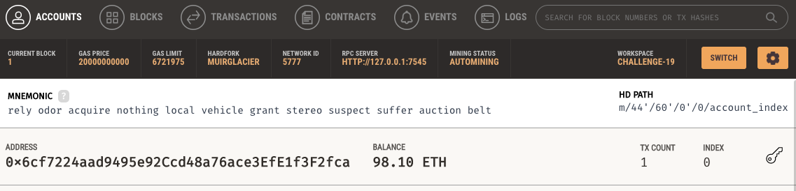
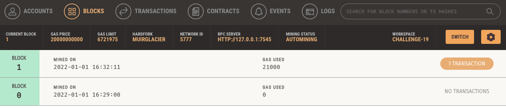
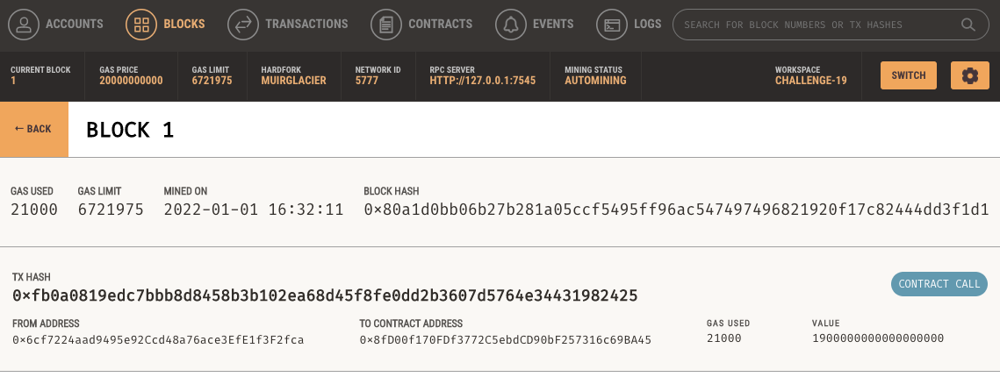
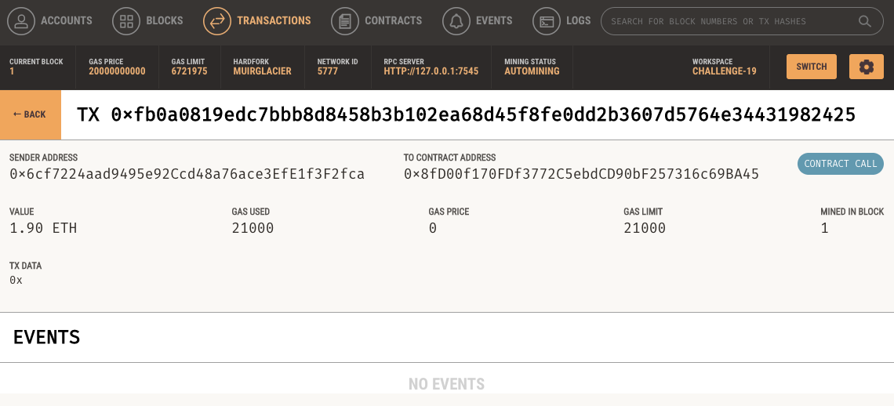

# Hire A Pro!
### Onchain payments for crypto pros

---

## Description
Allows the user to navigate to the webiste, look through various fintech/crypto professionals, and hire the individual(s) using eth to pay for the services.

---

## Requirements & Installations 
- Python 3.7 or above
- Streamlit: `pip install streamlit`
- web3: `pip install web3`
- [Ganache](https://trufflesuite.com/ganache/)

---

## Use

- Select the individual you would like to hire using the dropdown.
- Enter the estimated number of hours you wish to hire them for. 
- Click `Send Transaction` when you are ready to pay for their services.
- Once you send the transaction, the resulting transaction hash will be displayed in the bottom left.

As you can see in the image, your account address and balance are displayed in the top left.  
You can view the hourly rate, the pro's address, and the calculated amount to send (in ether) for the job.  
  

  

When you navigate to the blockchain explorer, in this case this is Ganache, you can view your account, the blocks that have been mined, the block containing the transaction, and all the transaction details.  

  
Ganache Accounts  

  
All currently mined blocks    

  
The block where the payment was mined  

  
Transaction details stored on-chain  

---

## Contributors
Eamon Conheady

---

## License

MIT License